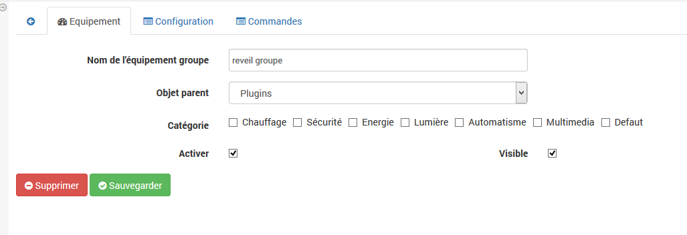
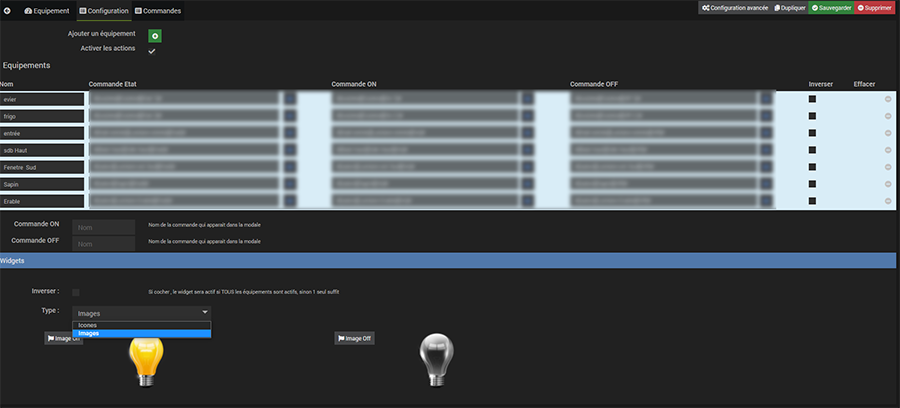
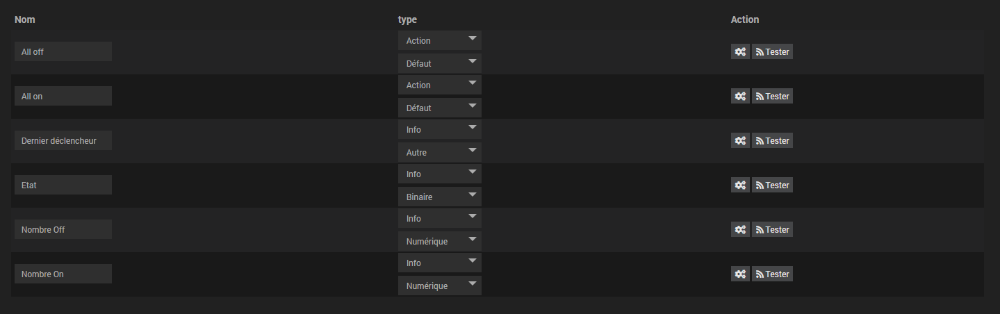
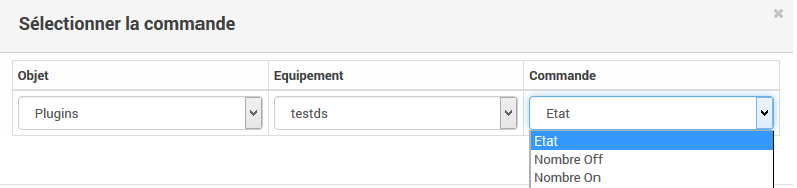
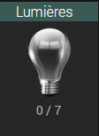
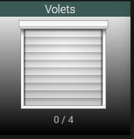
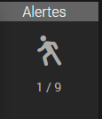
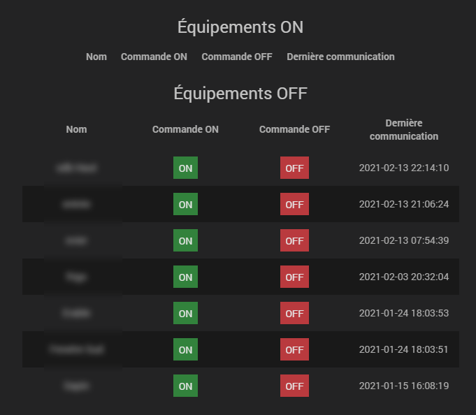

Description 
===========

Ce plugin permet de connaître l'état d'un groupe de commande et d'afficher le widget dans les différentes vues avec icônes personnalisables.

Installation
=============

Comme n'importe quel plugin.Après l'avoir activé il faut ensuite aller dans Plugins/Monitoring/Groupe

Utilisation
===========

Créer un nouvel équipement en cliquant sur le +

Ensuite il faut activer l'équipement

Ensuite le configurer

**Ajouter un équipement**: Permet de sélectionner un équipement avec les commandes d'état et les commandes actions en option si "activer les actions" est coché

**Icone ON** : Icône qui apparaîtra quand au moins 1 commande sera active

**Icone Off** : Icône qui apparaîtra quand toutes les commandes seront inactives

### Ensuite possibilité de tester les différentes commandes

### Et les utiliser dans les scénarios

**Nombre off**: nombre d'équipement inactif

**Nombre on**: nombre d'équipement actif

**Etat**: Etat du widget (1 = 1 ou plusieurs actifs et 0 = tous inactifs)

Le widget
====

> NOTE
>
> Le widget se met à jour dés qu'il y a un changement d'état.
>
> Un clic sur les infos permet de changer d'état. C'est à dire que s'il n'y a aucun équipement d'activé ils seront tous activés.Et si au moins un est activé il sera désactivé 
>
> Un clic sur l'icône ouvre une fenêtre

