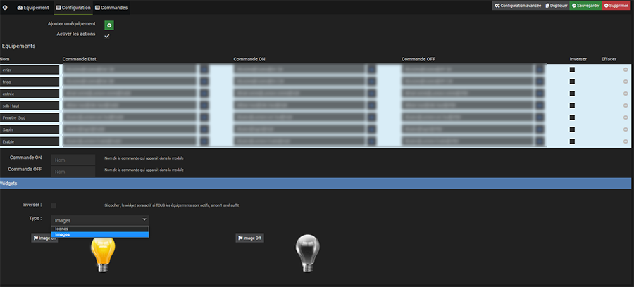
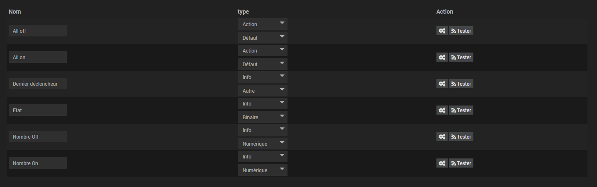
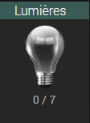
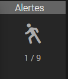
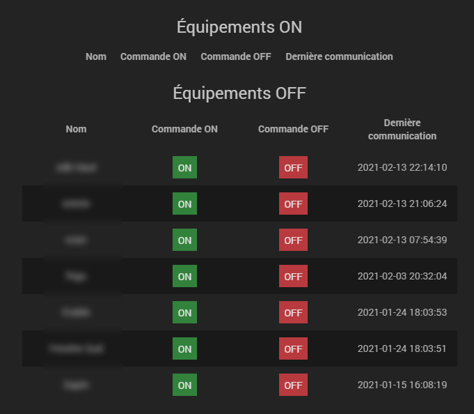

> <h1>Update Février 2021</h1>
>
> **La mise à jour effectue un changement de répertoire des images suite à une mise à jour du core et permet d'eviter l'effacement des fichiers non utilisés (en cas d'échec lors de la mise à jour**
>
>**Aller dans la configuration générale du plugin après la mise à jour . Un bandeau vert doit être visible**
>
>
>
>**Sinon choissisez un backup récent en cliquant sur le bouton "Mettre à jour les fichiers"**

Description 
===========

Ce plugin permet de connaître l'état d'un groupe de commande et d'afficher le widget dans les différentes vues avec icônes personnalisables.

Installation	
=============

Comme n'importe quel plugin.Après l'avoir activé il faut ensuite aller dans Plugins/Monitoring/Groupe

Configuration
===========

Créer un nouvel équipement en cliquant sur le +

**Ajouter un équipement**: Permet de sélectionner un équipement avec les commandes d'état et les commandes actions en option si "activer les actions" est coché

**Inverser** : Si cocher , l'icone/image passera sur actif seulement si tous les équipements sont actifs

**Icone ON** : Icône du widget quand au moins 1 commande sera active

**Icone Off** : Icône du widget quand toutes les commandes seront inactives

**Image ON** : Image du widget quand au moins 1 commande sera active

**Image Off** : Image du widget quand toutes les commandes seront inactives

Les commandes
===

Le widget
====

> NOTE
>
> Le widget se met à jour dés qu'il y a un changement d'état.
>
> Un clic sur les infos permet de changer d'état. C'est à dire que s'il n'y a aucun équipement d'activé ils seront tous activés (All ON).Et si au moins un est activé il sera désactivé (All OFF) 
>
> Un clic sur l'icône ouvre une fenêtre

